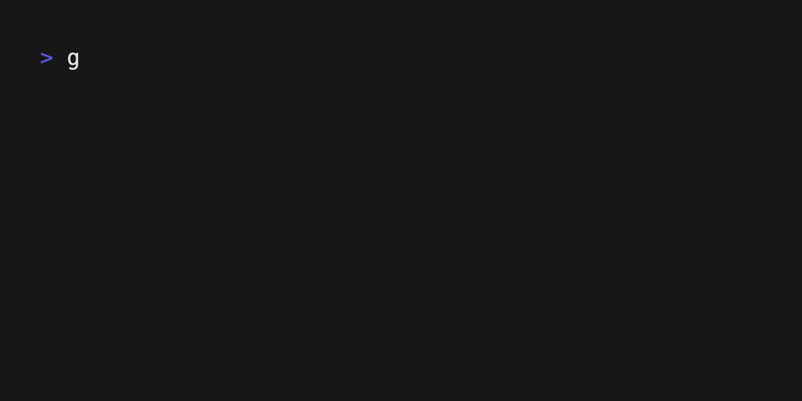

# GG - a CLI for ticket ping-pong

 

Sometimes you just want to fix something, not click through JIRA and copy-paste 
issue identifiers all over the place. There are better ways but sometimes a cli
is quicker.



## Install
```bash
brew tap bricktopab/gg
brew install gg
```

This tool provides a CLI which:
* Creates a JIRA issue and a local branch with corresponding name
* Looks up one of your issues and creates a local branch
* Creates a PR with naming that matches your ticket

| Command       | Description                                                    |
|---------------|----------------------------------------------------------------|
| `gg n`        | Creates a JIRA issue and a local branch with corresponding name|
| `gg i`        | Looks up one of your issues and creates a local branch         |
| `gg pr`       | Creates a PR with naming that matches your ticket              |

Naming formats and some details are according to current needs 
Here is a table summarizing the commands provided by the tool:

* JIRA key: `ISSUE-123`
* summary: `CLI for easy life`
* description:`you know...`

- lcoal branch: `ISSUE-123_CLI-for-easy-life`
- GitHub PR: `feat(ISSUE-123): CLI for easy life`

Could of course be extended or made configurable as long as it's doesn't get
to complex.

Terminal fancyness comes from external libs like [charmbracelet/huh](https://github.com/charmbracelet/huh) and [urfave/cli](https://github.com/urfave/cli). 


## Development

Releases are handled by [GoReleaser](https://goreleaser.com/)

Try out a release locally: `goreleaser release --snapshot --clean`
...or just for your local system: `goreleaser build --single-target`
